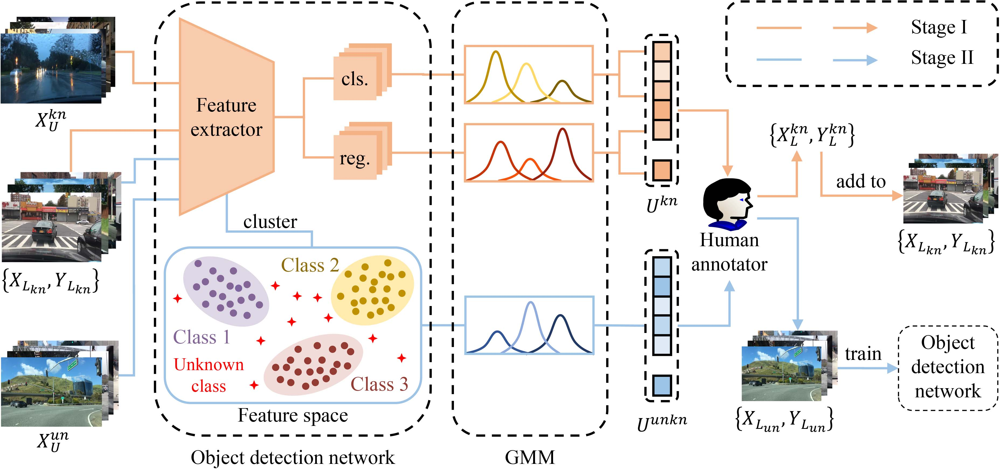

# UADL: Uncertainty-Driven Active Developmental Learning

This repository has the source code of the paper: 

**UADL: Uncertainty-Driven Active Developmental Learning**

Qinghua Hu, Luona Ji, Yu Wang, Shuai Zhaoa, Zhibin Lin

The proposed method is implemented based on the [open-mmlab/mmdetection](https://github.com/open-mmlab/mmdetection).

  The framework of UADL. UADL utilizes GMMs to measure uncertainty and detect two types of unlabeled samples: (1) unfamiliar samples of known classes $X_U^{kn}$ and (2) samples containing novel classes $X_U^{un}$, in two stages (Stage I: unfamiliar detection of known classes and Stage II: unknown detection of novel classes). In Stage I, GMMs model the classification and regression localization heads to estimate known-class uncertainty $U^{kn}$. This uncertainty predicts the model's familiarity with each sample. In Stage II, the feature of known classes is clustered and modeled by class-specific GMMs to calculate the candidate sample's unknown-class uncertainty $U^{unkn}$. This uncertainty assesses the presence of novel classes. In both stages, a limited number of highly uncertain samples are selected for manual labeling. These labeled samples $\{X_{L_{kn}}, Y_{L_{kn}}\}$ and $\{X_{L_{un}}, Y_{L_{un}}\}$ are used to train the model to learn unfamiliar known classes and unknown novel classes separately.

**Abstract**

Existing machine learning models can well handle common classes but struggle to detect unfamiliar or unknown classes due to environmental variations. To address this challenge, we propose a new task called active developmental learning (ADL), which empowers models to actively determine what to learn in the open world, thereby progressively enhancing the capability of detecting unfamiliar and unknown classes. Considering the uncertain essence of the task, we design an uncertainty-driven method for ADL (UADL) that measures and utilizes uncertainty to evaluate unfamiliar known classes and unknown classes separately, which consists of two stages: (1) unfamiliar detection of known classes and (2) unknown detection of novel classes. In the first stage, UADL identifies unfamiliar samples of known classes via known-class uncertainty calculated by GMMs on detectors' heads. In the second stage, UADL identifies samples containing unknown classes via unknown-class uncertainty computed by class-specific GMMs in feature space. In both stages, uncertainty is used to select a minimal number of unlabeled samples for manual labeling, facilitating the model's active self-development. Experiments on multiple {object detection} benchmark datasets demonstrate the feasibility and significant performance of UADL and show its effectiveness against the ADL task compared to other state-of-the-art approaches.
